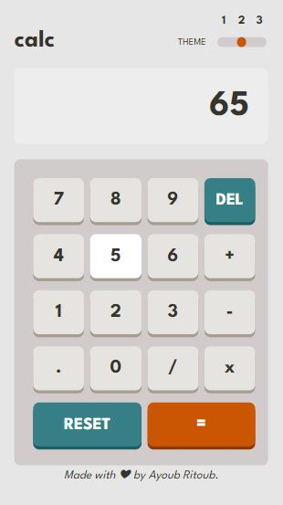
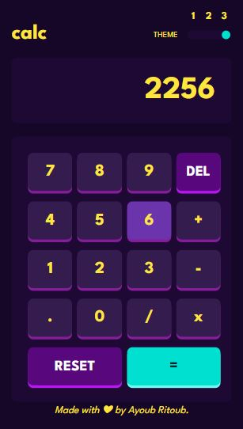

# Calculator Web App 

## Table of contents

- [Overview](#overview)
  - [Screenshot](#screenshot)
  - [Features](#Features)
  - [Usage](#Usage)
  - [Links](#links)
- [My process](#my-process)
  - [Built with](#built-with)
  - [Continued development](#continued-development)
- [Credits](#Credits)
- [Author](#author)

## Overview
This is a basic calculator web app built using HTML, CSS, and JavaScript. The app allows users to perform simple arithmetic operations such as addition, subtraction, multiplication, and division. The app also includes three themes - basic, dark, and light - that users can switch between.

### Screenshot

**Basic**

**Light**

**Dark**

### Features

Basic arithmetic operations
Three themes - basic, dark, and light
Responsive design using CSS grids, media queries, and flexbox.

### Usage

-To use the calculator, simply click the buttons on the keypad to input numbers and operations. The app will display the result of the calculation in real time. To switch between themes, click the theme buttons located in the top right corner of the app.

### Links

-Code URL: (https://github.com/Ayoub010001/Calculator-App.git)
-Live Site URL: (https://your-live-site-url.com)

## My process
-During the development of this calculator web app, I started by strated by designing the structure and user interface using HTML and CSS, Then I added Javascript functionalities to handle user behaviours and perform calculations, I used Event listeners to detect button clicks and update the screen display in real time.
-To create a responsive design and make the web app adapts to different screen sizes I used CSS grids and Media queries.finally i tested the functionalites and insure that the three different themes functioning correctly.

### Built with

    - Semantic HTML5 markup
    - CSS custom properties
    - Media Queries
    - CSS Grid
    - JavaScript

### Continued development

-While building this calculator web app was a great learning experience, there are still areas that I want to continue focusing on in future projects. In particular, I want to continue to develop my skills in JavaScript to create more complex and interactive web applications. 

## Credits

-This project was created by [Ayoub Ritoub].Special thanks to front-end Mentor for providing this challenge.

## Author

- Website - [Ayoub Ritoub](coming soon)
- Instagram - [@Ayoubritoub](https://www.instagram.com/ayoubritoub)
